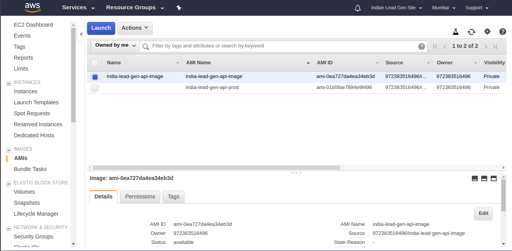
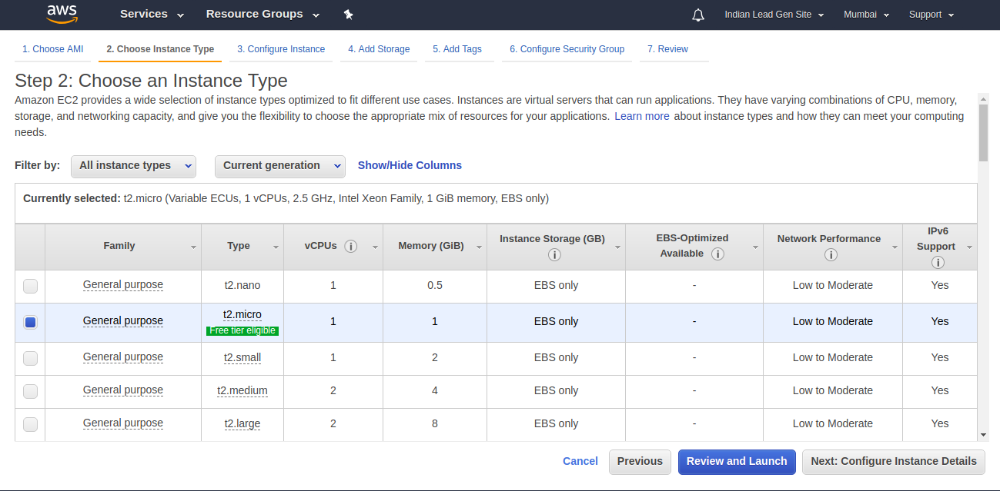
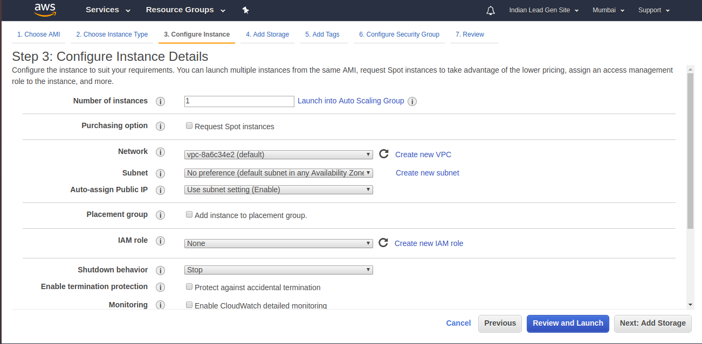
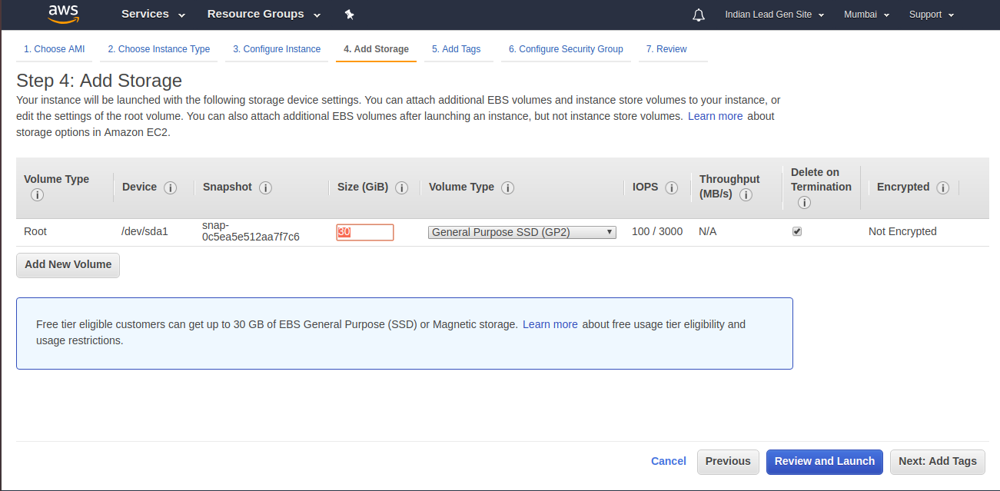
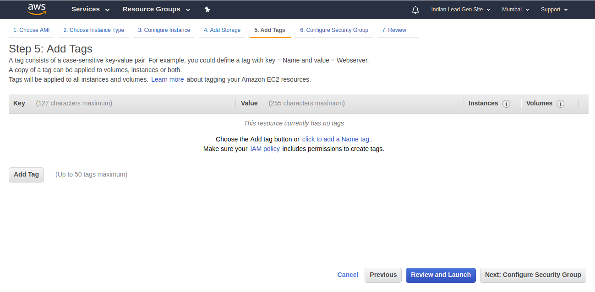
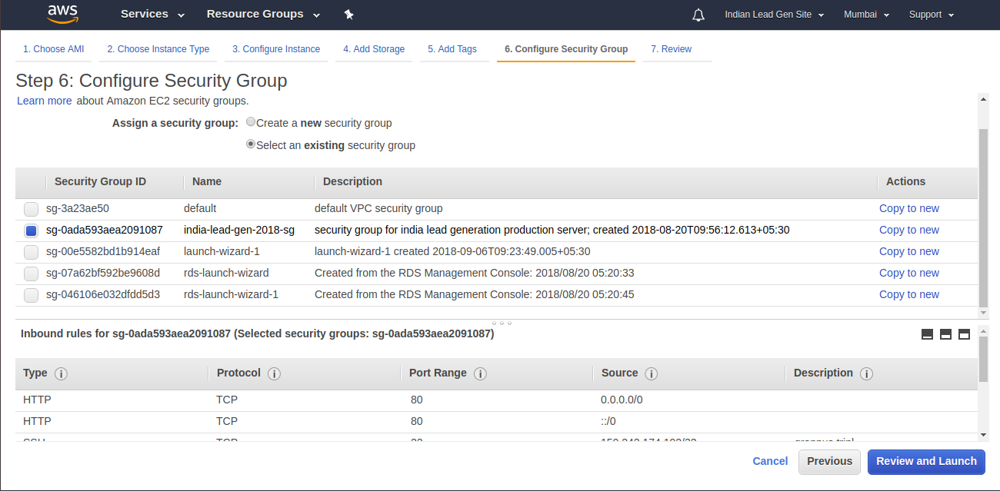
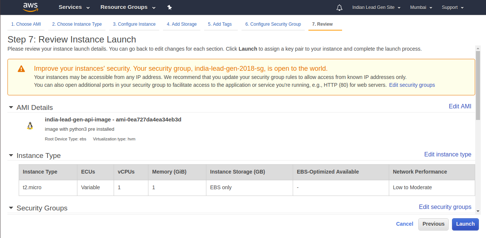
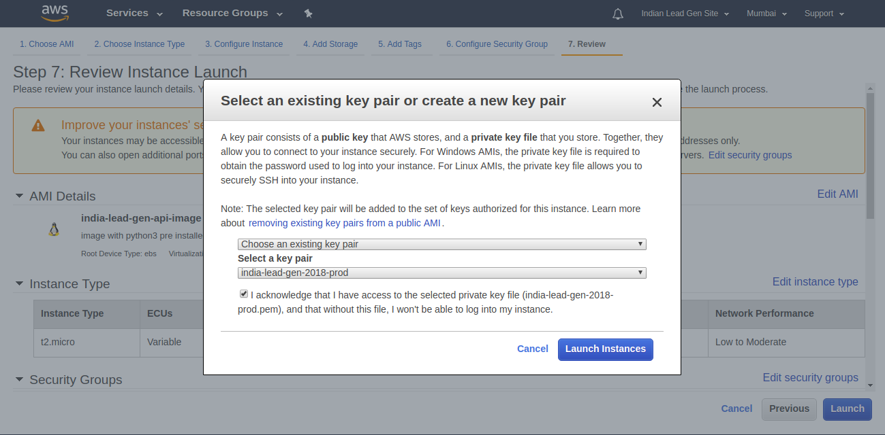

# Uber Referral

This README includes instructions for developers and maintainers for this repository.

# 1 Instructions for Developers

## 1.1 Branches & Environments

### 1.1.1 Branches
    There are 3 main branches namely, master, beta and develop. Other then that you must follow git flow to push your code to develop branch.
    So there are some strict rules when it comes to merging. These rules are given below
        a) You can merge "master" into "beta".
        b) You can merge "beta" into "master" and "develop".
        c) You must have to create apull request to merge code into beta and master branch.

## 1.2 Commit Process

### 1.2.1 Commit Format

Use the multi-line format defined below (do not use `-m` and go through editor):

```
[<task-id>] <task-summary>
<blank line>
- <commit description line 1>
- <commit description line 2>
- <commit description line 3>
```

In the header line `<task-id>` is the JIRA task id, and `<task-summary>` is the JIRA task summary.

**NOTE**: The blank line is important. That's what makes git know that you have a header line.

Also, optionally, you may include lines using the [smart commit syntax](https://confluence.atlassian.com/bitbucket/processing-jira-software-issues-with-smart-commit-messages-298979931.html) in your summary.

### 1.2.3 commit and Merge

1. `$ git add <your files..>`
2. `$ git commit` to create a commit
3. `$ git pull --rebase` to get changes from repository.
4. In case the above steps gives you any conflicts:
    1. Resolve the conflicted files by manually inspecting
    2. `git add` all conflicted files resolved manually by you
    3. `$ git rebase --continue` to tell git that you have resolved the conflicts. This may ask you to create another commit.

### 1.2.4 Push to remote

```
$ git push
```

## 1.3 Coding Standards

### 1.3.1 Python

#### 1.3.1.1 Coding Standards

We would follow the following standards:

- [PEP8](https://www.python.org/dev/peps/pep-0008/)
- [PEP257](https://www.python.org/dev/peps/pep-0257/)

Additionally, look at this [presentation](http://python.net/~goodger/projects/pycon/2007/idiomatic/presentation.html)


# 2 Development Environment Setup

## 2.1 Ubuntu 16.04

### 2.1.1 Download and Installation

-Suggested OS is Ubuntu 16.04. Install python3.7 before proceeding further: https://tecadmin.net/install-python-3-6-ubuntu-linuxmint/

### 2.1.2 How to setup new development workspace
    a) create a directory let say "uber-referral"
    b) run "cd path_to_directory"
    c) run "sudo apt-get install python3-venv"
    d) run "python3 -m venv ."
    e) run "git init"
    f) run "git remote add origin your_repo_path_url"
    g) run "git fetch --all"
    h) run "git checkout develop"
    i) run "git pull origin develop"
    j) run "source bin/activate"
    k) run "pip install -r requirements.txt"
    l) run "cp sample-file.env .env" and change env variable values accordingly
    m) run "mkdir log". This directory will used to store app logs.
    n) run "cd src"
    0) run "python manage.py runserver 0.0.0.0:8000"


## 3.1 Ubuntu 16.04 AWS Instance

### 3.1.1 Launch Instance


Begin the process of launching an instance from AMI image as shown in the following image:


Select `t2.small` instance type and choose configure instance details as shown in the following inage:


Continue to adding storage as shown in the following image:


Select `30` (GB) storage and proceed to configuring tags as shown in the following image:


Optionally add any tags and proceed to configuring security groups as shown in the following image:


Select `Select an existing security group` and choose `india-lead-gen-2018-sg` and proceed to 'review and launch' as shown in the following image:


Review the instance configuration and proceed to launching as shown in the following image:


Select the SSH key pair to use, accept the terms and launch the instance as shown in the following image:


### 3.1.2 Configuration
For Setting up Django with Nginx, Gunicorn and  supervisor refer to http://michal.karzynski.pl/blog/2013/06/09/django-nginx-gunicorn-virtualenv-supervisor/

# 4 QA Environment Setup

A QA setup is a hybrid of a development setup and a production setup. Hence, as you'll see in the sections below - some sections refer '2 Development Environment Setup' and some refer to '3 Preprod Environment Setup'.

## 4.1 Ubuntu 16.04

### 4.1.1 Download and Installation

Please refer section 2.1.1

### 4.1.2 How to setup new development workspace

Please refer section 2.1.2

# 5 Developer:
    a) Virender Bhargav (raif.viren@gmail.com)

# 6 Tech Stack:
    In this project we are using
        a) Django 3.0.7 with python 3.7.5
        b) postgresql with psycopg2
        c) EC2 of AWS for servers
        d) RDS for postgresql deployment

    
# 7 How to deploy new commit:
    a) Login into appropriate server using pem file
    b) switch user to plateiq
        "sudo su - plateiq"
    c) pull appropriate branch
        for develop do
            "git pull origin develop"       
    d) exit and restart supervisor
        "sudo service supervisor restart" 
